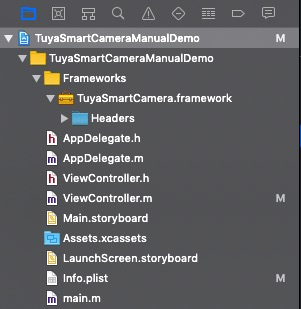
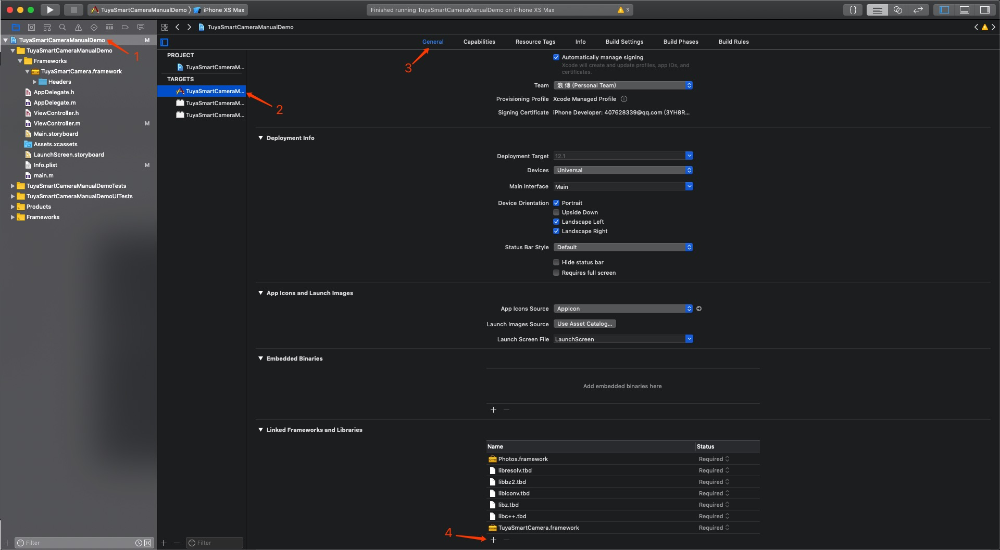
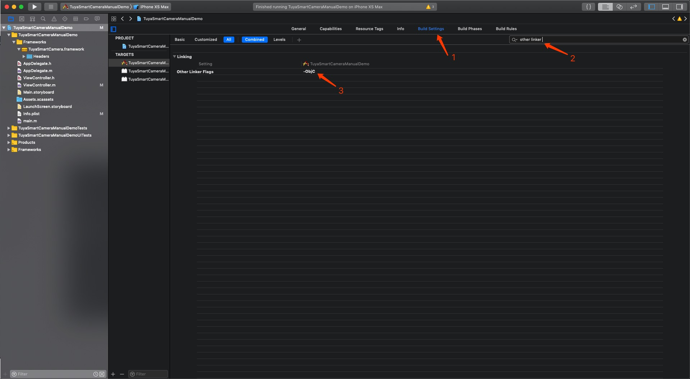

# TuyaSmartCamera SDK


### Version record

| Date | Description |   Author   |
| :-------- | --------:| :------: |
| 2018-07-31 | V1.0.0 |  Lang.Fu  |
| 2018-11-19 | V2.0.0：add  bare  stream  interface | Lang.Fu |
| 2018-12-24 | V3.0.0：add  multiple version  camera | Lang.Fu |
| 2019-01-15 | V3.1.0:  bare stream interface  change.  Screenshot and  recording video saved in  custom  photo  album, which named same as App name. | Lang.Fu |

### Quick Integration

Using cocapods, add below detail in pod file.

```ruby
platform :ios, '8.0'

target 'your_target_name' do

   pod "TuyaSmartCamera", :git => "https://github.com/TuyaInc/tuyasmart_camera_ios_sdk.git"

end
```

Excute pod update in project root file.

How to use cocoapods：[CocoaPods Guides](https://guides.cocoapods.org/)

### Import Framework Manually

After adding TuyaSmartCamera.framework in project category, the porject category like below:



Then choose project related target, under general setting, add system dependencies to "Linked Frameworks and Libraries", the required dependencies are: "Photos.framework", "libresolv.tbd", "libbz2.tbd", "libiconv.tbd", "libz.tbd", "libc++.tbd". like below:



Then switch to "Build Settings", enter "other linker" in the search box, and add "-ObjC" in "Other Linker Flags", like below：



### Preparing

TuyaSmartCamera relies on the Tuya Smart iOS SDK, when accessing this SDK, you need to access TuyaSmartHomeKit (Click [Here](https://github.com/TuyaInc/tuyasmart_home_ios_sdk/blob/master/ios-sdk.md) to view the document) .

Add blow code to AppDelegate.m top :

```objective-c
#import <TuyaSmartCamera/TuyaSmartCameraFactory.h>
```

Adding initial SDK code in [AppDelegate application:didFinishLaunchingWithOptions:]: (Vsesion 3.0.0 did be deprecated)

```objective-c
// 3.0.0 version did deprecated this methord。sdk will initialize when create camera first time
[TuyaSmartCameraFactory initSDKs];
```

### Example Code Appointment

Under below example code，if there is no special statement， all are under ViewController： 

```
@interface ViewController : UIViewController

@end

@implementation ViewController

// all example code in there

@end
```

Like self.prop， we appoint prop property has right realization under ViewController，like：

```
self.device = [[TuyaSmartDevice alloc] initWithDeviceId:@"your_device_id"];
```

if we want it excute correctly，need to add one TuyaSmartDevice property in ViewController：

```
@property (nonatomic, strong) TuyaSmartDevice *device;
```

The rest can be done in the same manner

### Initialize

* TuyaSmartHomeKit general interface introduction

  After integrate with TuyaSmartHomeKit， and initialize the SDK， need to use general interface to call service  api to get camera configurations parameter.

  ```objective-c
  - (void)load {
      //self.request = [TuyaSmartRequest alloc] init];

      /**
  	 *  request service api
  	 *
  	 *  @param apiName	aip name
  	 *  @param postData parameters
  	 *  @param version  api version
  	 *  @param success  success callback
  	 *  @param failure  failure callback
  	 */
      [self.request requestWithApiName:@"api_name" postData:@"post_data" version:@"api_version" success:^(id result) {
          
      } failure:^(NSError *error) {
          
      }];	
  }
  ```

- Camera configurations parameter interface

  * Interface introduction

    | Name                  | Version | Description           |
    | --------------------- | ------- | --------------------- |
    | tuya.m.ipc.config.get | 1.0     | camera configurations |


  * Request parameters

    | Name  | Type     | Description      |
    | ----- | -------- | ---------------- |
    | devId | NSString | camera device id |

    ```objective-c
    NSDictionary *params = @{
    	@"devId": @"XXXXXXXX" 
    };
    ```

  * Response parameter

    | Name              | Type         | Description                         |
    | ----------------- | ------------ | ----------------------------------- |
    | result            | NSDictionary | result data                         |
    | result.id         | NSString     | device id                           |
    | result.p2pConfig  | NSDictionary | expand configurations               |
    | result.p2pId      | NSString     | p2p connect id                      |
    | result.password   | NSString     | p2p connect password                |
    | result.timeZoneId | NSString     | device time zone                    |
    | status            | NSString     | status（success：ok； fail：error） |
    | success           | BOOL         | whether success                     |

    ```json
    {
    	result = 	{
    		password = "xxxxxx",
    		id = "xxxxxxxxxxxxxxxxxx",
    		p2pConfig = 	{
    		},
    		p2pId = "XXXXXXXXXXXXXXXXXXX",
    		timeZoneId = "Asia/Shanghai",
    	},
    	success = 1,
    	status = "ok",
    }
    ```

- Create camera object

  * Camera configuration parameter property introduction

    | Name      | Type         | Description                       |
    | --------- | ------------ | --------------------------------- |
    | p2pId     | NSString     | p2p connect id                    |
    | password  | NSString     | p2p connect password              |
    | localKey  | NSString     | LAN password                      |
    | p2pConfig | NSDictionary | camera p2p channel configurations |

  * When create camera，add below code to input head files：

    ```
    #import <TuyaSmartCamera/TuyaSmartCameraFactory.h>
    ```


  * Add below code to create configurations parameter and create camera object:

    ```objective-c
    //self.devId = @"your_device_id";
    //self.request = [TuyaSmartRequest alloc] init];
    //self.device = [TuyaSmartDevice deviceWithDeviceId:self.devId];

    //p2p type，the SDK creates different versions of the camera object based on the p2p type
    id p2pType = [self.device.deviceModel.skills objectForKey:@"p2pType"];

    __weak typeof(self) weakSelf = self;
    [self.request requestWithApiName:@"tuya.m.ipc.config.get"   
     						postData:@{@"devId":self.devId} 
     						 version:@"1.0" 
     						 success:^(id result) {
    	TuyaSmartCameraConfig *config = [TuyaSmartCameraConfig new];
        config.p2pId = [result objectForKey:@"p2pId"];
        config.password = [result objectForKey:@"password"];
        config.localKey = self.device.deviceModel.localKey;
    	config.p2pConfig = [result objectForKey:@"p2pConfig"];
        weakSelf.camera = [TuyaSmartCameraFactory cameraWithP2PType:p2pType 
                           									 config:config
                           								   delegate:self];
        } failure:failure];
    ```

until now, we build the camera successfully , then we can begin to use the function of the camera

### Camera Function

* Failed call back

  The result of all camera's operation is called back through TuyaSmartCameraDelegate。 if the operation failed，call back will happen through below methord.

  ```objective-c
  - (void)camera:(id<TuyaSmartCameraType>)camera didOccurredError:(TYCameraErrorCode)errCode;
  ```

  Errcode means certain operation failed, the definition of errcode is below

  ```objective-c
  typedef enum {
      TY_ERROR_NONE,                      // 0
      TY_ERROR_CONNECT_FAILED,            // 1    connect failed
      TY_ERROR_CONNECT_DISCONNECT,        // 2    connect did disconnected
      TY_ERROR_ENTER_PLAYBACK_FAILED,     // 3    connect playback channel failed
      TY_ERROR_START_PREVIEW_FAILED,      // 4    preview failed. if the connection is broken during hte preview process, it will alse call back this error.
      TY_ERROR_START_PLAYBACK_FAILED,     // 5    playback failed. if the connection is broken during the playback process, it will alse call back this error.
      TY_ERROR_PAUSE_PLAYBACK_FAILED,     // 6    pause playabck failed
      TY_ERROR_RESUME_PLAYBACK_FAILED,    // 7    resume playabck failed
      TY_ERROR_ENABLE_MUTE_FAILED,        // 8    mute failed.
      TY_ERROR_START_TALK_FAILED,         // 9    start talk to device failed
      TY_ERROR_SNAPSHOOT_FAILED,          // 10   get screenshot failed
      TY_ERROR_RECORD_FAILED,             // 11   record video failed
      TY_ERROR_ENABLE_HD_FAILED,          // 12   set definition state failed
      TY_ERROR_GET_HD_FAILED,             // 13   get definition state failed
      TY_ERROR_QUERY_RECORD_DAY_FAILED,   // 14   query video record date failed
      TY_ERROR_QUERY_TIMESLICE_FAILED,    // 15   query video record slice failed
  } TYCameraErrorCode;
  ```


* Video render view

  * Get the video render view

    ```objective-c
    - (void)viewDidLoad {
    	CGFloat ScreenWidth = [UIScreen mainScreen].bounds.size.width;
    	CGFloat ScreenHeight = [UIScreen mainScreen].bounds.size.height;
    	CGFloat VideoWidth = ScreenWidth;
    	CGFloat VideoHeight = VideoWidth * 9 / 16;
       
    	UIView<TuyaSmartVideoViewType> *videoView = [self.camera videoView];
    	videoView.frame = CGRectMake(0, 64, VideoWidth, VideoHeight);
    	[self.view addSubview:videoView];
    }
    ```

    ​


  * Video frame zoom in, move and clear

    ```objective-c
    // Enlarge the video image by 1.2 rate
    [videoView tuya_setScaled:1.2];
    // Move the video image to the right by 10.0 pt points
    [videoView tuya_setOffset:CGPointMake(10.0, 0.0)];
    // Clear the image and reset the zoom factor and offset
    [videoView tuya_clear];
    ```

* Connect p2p channel

  ```objective-c
  // connect
  - (void)viewDidLoad {
      // other code...
  	[self.camera connect];
  }

  // callback for connected success
  - (void)cameraDidConnected:(id<TuyaSmartCameraType>)camera {
      self.isConnected = YES;
  }

  // callback for connected faild or disconnected
  - (void)cameraDisconnected:(id<TuyaSmartCameraType>)camera {
      self.isConnected = NO;
      NSLog(@"---disconnected");
  }
  ```

* Connect playback channel

  P2p connection need to build two channel, the original channel is used for give command and transmit preview audio and video data. if you want to have playback functionm , you should build another playback channel to transmit the audio and video data

  ```objective-c
  - (void)cameraDidConnected:(id<TuyaSmartCameraType>)camera {
      self.isConnected = YES;
      // connect playback channel
      [self.camera enterPlayback];
  }

  // callback for playback channel connected success
  - (void)cameraDidConnectPlaybackChannel:(id<TuyaSmartCameraType>)camera {
      NSLog(@"---didconnectedplayback");
  }
  ```

* Play mode

  Define playback or preview, when set the status of mute, need to put the parameter inside， to define which mode is mute

  ```objective-c
  typedef NS_ENUM(NSUInteger, TuyaSmartCameraPlayMode) {
      TuyaSmartCameraPlayModeNone,        // none
      TuyaSmartCameraPlayModePreview,     // live video
      TuyaSmartCameraPlayModePlayback     // playback
  };
  ```

* Start preview

  ```objective-c
  - (void)startPreview {
      //  Determine if the video is being recorded, and if you are recording a video, stop recording. (whether the status in the recording is maintained by the developer himself)
      if (self.isRecording) {
      	[self.camera stopRecord];
      }
      // Determine if you are previewing, if you are previewing, stop previewing. (whether the state in the preview is maintained by the developer itself)
  	if (self.isPlaybacking) {
  		[self.camera stopPlayback];
  	}
      // Determine if the p2p channel is connected. If it is not connected or the connection has been disconnected, connect the channel. (The state of whether the p2p channel is connected is maintained by the developer itself)
  	if (!self.isConnected) {
  		[self.camera connect];
  	}
      // start preview
  	[self.camera startPreview];
  }

  // callback for start preview success
  - (void)cameraDidBeginPreview:(id<TuyaSmartCameraType>)camera {
     	// current play mode
      self.playMode = TuyaSmartCameraPlayModePreview;
     	// status for preview
      self.isPreviewing = YES;
  }
  ```

  * Attention, current camera status, such as:preview, record, playback, p2p channel, disconnected, is maintained by developer, sdk will not store the status information, sdk only responsible for give command and call back.

* Stop preview

  ```objective-c
  - (void)stopPreview {
  	// if in recording, stop recording
      if (self.isRecording) {
  		[self.camera stopRecord];
  	}
      // if in talking, stop talking
      if (self.isTalking) {
  		[self.camera startTalk];
      }
      // stop preview, this operation will not fail
  	[self.camera stopPreview];
      self.isPreviewing = NO;
      self.playMode = TuyaSmartCameraPlayModeNone;
  }

  // callback for stop preview success
  - (void)cameraDidStopPreview:(id<TuyaSmartCameraType>)camera {
      NSLog(@"---stop preview");
  }
  ```

* Get the date which have playback record

  Before start playback, need to get the record the playback history, firstly get the date in which has the playback record

  ```objective-c
  - (void)queryPlaybackDays {
      // query the date of video recording in a month.
      [self.camera queryRecordDaysWithYear:2018 month:7];
  }

  // call back for query success
  - (void)camera:(id<TuyaSmartCameraType>)camera didReceiveRecordDayQueryData:(NSArray<NSNumber *> *)days {
      // days the array of days，ex: [@(1), @(2), @(5), @(6), @(31)]; express in this month, 1，2，5，6，31  has video record.
      self.playbackDays = days;
      self.curentDay = days.lastObject.integerValue;
  }
  ```

* Get the record of play back record.

  Gfter getting effective date of play back record, get the playback record according to the date

  ```objective-c
  - (void)queryPlaybackRecords {
      // query all video record slices for a particular day.
      [self.camera queryRecordTimeSliceWithYear:2018 month:7 day:self.curentDay];
  }

  // callback for query success
  - (void)camera:(id<TuyaSmartCameraType>)camera didReceiveTimeSliceQueryData:(NSArray<NSDictionary *> *)timeSlices {
      /*
      timeSlices the array of playback video record information. the element is a NSDictionary, content like this:
   kTuyaSmartPlaybackPeriodStartDate  ： startTime(NSDate)
   kTuyaSmartPlaybackPeriodStopDate   ： stopTime(NSDate)
   kTuyaSmartPlaybackPeriodStartTime  ： startTime(NSNumer, unix timestamp)
   kTuyaSmartPlaybackPeriodStopTime   ： stopTime(NSNumer, unix timestamp)
      */
      self.timeSlices = timeSlices;
  }
  ```

* Start play back

  ```objective-c
  - (void)startPlayBack:(NSDictionary)timeSlice {
      // If in previewing, stop previewing. This includes stopping recording, intercoming, etc. See the stop preview method above for details.
      if (self.isPreviewing) {
          [self stopPreview];
      }
      // timeSlice: Taken from an element in the video clip playback information array above
      NSInteger startTime = [[timeSlice objectForKey:kTuyaSmartTimeSliceStartTime] integerValue];
      NSInteger stopTime = [[timeSlice objectForKey:kTuyaSmartTimeSliceStopTime] integerValue];
      // Start playback of the video clip, pass in the timestamp of the start of playback, start timestamp of the video clip, end timestamp
      // The timestamp to start playing needs to be between the start time and the end time of the video clip, where the default starts from the start time.
      [self.camera startPlayback:startTime startTime:startTime stopTime:stopTime];
  }

  // callback for start playback success
  - (void)cameraDidBeginPlayback:(id<TuyaSmartCameraType>)camera {
      self.playMode = TuyaSmartCameraPlayModePlayback;
      self.isPlaybacking = YES;
  }
  ```

* Pause play back

  ```objective-c
  - (void)pausePlayback {
      // if in recording, stop recording
      if (self.isRecording) {
  		[self.camera stopRecord];
  	}
      // pause playback
  	[self.camera pausePlayback];
  }

  // callback for pause playback
  - (void)cameraDidPausePlayback:(id<TuyaSmartCameraType>)camera {
      NSLog(@"---pause playback");
  }
  ```

* Resume play back

  ```objective-c
  - (void)resumePlayback {
      // resume playback
      [self.camera resumePlayback];
  }

  // callback for resume playback success
  - (void)cameraDidResumePlayback:(id<TuyaSmartCameraType>)camera {
      NSLog(@"---resume playback");
  }
  ```

* Stop play back

  ```objective-c
  - (void)stopPlayback {
      // if in recording, stop recording
      if (self.isRecording) {
  		[self.camera stopRecord];
  	}
      // stop playback
  	[self.camera stopPlayback];
  }

  // callback for stop playback success
  - (void)cameraDidStopPlayback:(id<TuyaSmartCameraType>)camera {
      self.playMode = TuyaSmartCameraPlayModeNone;
      self.isPlaybacking = NO;
  }
  ```

* Playback finish call back

  ```objective-c
  // This callback is triggered when the video clip playback ends. Some devices automatically play the next video clip of the day, and the callback will not be triggered until all video clips of the day have finished playing. When to trigger, depends on the implementation of the device firmware.
  - (void)cameraPlaybackDidFinished:(id<TuyaSmartCameraType>)camera {
      self.playMode = TuyaSmartCameraPlayModeNone;
      self.isPlaybacking = NO;
  }
  ```

* Get the first frame call back

  ```objective-c
  // This callback is triggered when the video frame is received for the first time after preview or playback begins. This indicates that the video has started playing normally.
  - (void)cameraDidReceiveFirstFrame:(id<TuyaSmartCameraType>)camera {
      NSLog(@"---receive first frame");
  }
  ```

* Start video recording

  ```objective-c
  - (void)startRecord {
      // If no video is playing, or it is already in recording, do nothing.
      if (self.playMode == TuyaSmartCameraPlayModeNone || self.isRecording) {
          return;
      }
      
      // if in talking, stop talking
      if (self.isTalking) {
  		[self.camera startTalk];
      }
      
      // start recording
      [self.camera startRecord];
  }

  // callback for start record success
  - (void)cameraDidStartRecord:(id<TuyaSmartCameraType>)camera {
      self.isRecording = YES;
  }
  ```

* Stop video recording

  ```objective-c
  - (void)stopRecord {
      // if in recording, stop recording
      if (self.isRecording) {
  		[self.camera stopRecord];
      }
  }

  // callback for stop record success
  - (void)cameraDidStopRecord:(id<TuyaSmartCameraType>)camera {
      self.isRecording = NO;
  }
  ```

  * if vidoe recorded. successfully, the picture will be stored in the phone photo album. the photo album name is same as App name.

* Video screenshot

  ```objective-c
  - (void)snapShoot {
  	// If no video is played, no action is taken
      if (self.playMode == TuyaSmartCameraPlayModeNone) {
          return;
      }
      // snapshoot
      [self.camera snapShoot];
  }

  // callback for snapshoot success
  - (void)camearaSnapShootSuccess:(id<TuyaSmartCameraType>)camera {
      NSLog(@"---snap shoot success");
  }
  ```

  * if screen shot successfully, the picture will be stored in the phone photo album.

* Mute

  ```objective-c
  - (void)enabelMute:(BOOL)isMuted {
  	// If no video is played, no action is taken
      if (self.playMode == TuyaSmartCameraPlayModeNone) {
          return;
      }
      // isMuted: YES-close sound of video；NO-open sound of video
      // default is YES
      [self.camera enableMute:isMuted forPlayMode:self.playMode];
  }

  // callback for mute state did changed
  - (void)camera:(id<TuyaSmartCameraType>)camera didReceiveMuteState:(BOOL)isMute playMode:(TuyaSmartCameraPlayMode)playMode {
  	self.isMuted = isMute;
  }
  ```

* Definition information access and change

  ```objective-c
  // start preview did success
  - (void)cameraDidBeginPreview:(id<TuyaSmartCameraType>)camera {
     	// other code ...
      // access definition
      [self.camera getHD];
      
      // change definition
      // [self.camera enableHD:YES];
  }

  // callback for definition state did changed
  - (void)camera:(id<TuyaSmartCameraType>)camera didReceiveDefinitionStatus:(BOOL)isHd {
      // isHd: is high definiton；YES-HD；NO-SD
  	self.isHd = isHd;
  }
  ```

* Start talking

  ```objective-c
  - (void)startTalk {
      // if in recording, stop recording
      if (self.isRecording) {
  		[self.camera stopRecord];
  	}
      
      // start talk to device
      [self.camera startTalk];
  }

  // call back for start talk success
  - (void)cameraDidBeginTalk:(id<TuyaSmartCameraType>)camera {
      self.isTalking = YES;
  }
  ```

* Stop talking

  ```objective-c
  - (void)stopTalk {
      // if in talking, stop talking
      if (self.isTalking) {
          [self.camera stopTalk];
      }
  }

  // callback for stop talking success
  - (void)cameraDidStopTalk:(id<TuyaSmartCameraType>)camera {
      self.isTalking = NO;
  }
  ```

  * Talking and recording are mutually exclusive, and talking can be turned on only when previewing.

* callback for  resolution did changed

  ```objective-c
  // call back for video resolution did changed
  - (void)camera:(id<TuyaSmartCameraType>)camera resolutionDidChangeWidth:(NSInteger)width height:(NSInteger)height {
      NSLog(@"---resolution changed: %ld x %ld", width, height);
  }
  ```

* Turn on the bare stream. If you need to get the original video frame data, you can enable  attribute.

  ```objective-c
  - (void)viewDidLoad {
  	// other init code
      // if camera.isRecvFrame is YES，the video will not be automatically rendered and the video frame data will be given by the proxy method below.
      self.camera.isRecvFrame = YES;
  }

  /**
   if 'isRecvFrame' is true, the video data will not decode in the SDK, and could get the orginal video frame data through this method.
   @param camera      camera
   @param frameData   original video frame data
   @param size        video frame data size
   @param frameInfo   frame header info
   */
  - (void)camera:(id<TuyaSmartCameraType>)camera ty_didReceiveFrameData:(const char *)frameData dataSize:(unsigned int)size frameInfo:(TuyaSmartVideoFrameInfo)frameInfo;

  ```

  * After the raw stream is opened, the original rendered view (videoVIew) will not render the image, and the developer needs to parse and render the data through the interface.

* Destory resource

  ```objective-c
  // when the view controller dealloc, destory the camera
  - (void)dealloc {
      [self.camera destory];
  }
  ```

  ​

### Preview procedure

```flow
st=>start: Start
e=>end: destroy
op=>operation: connect
op1=>operation: startPreview
op2=>operation: stopPreview
op3=>operation: disconnect
st->op->op1->op2->op3->e
```

### Playback procedure

```flow
st=>start: Start
e=>end: destroy
op=>operation: connect
op1=>operation: enterPlayback
op2=>operation: queryRecordTimeSlice
op3=>operation: startPlayback
op4=>operation: stopPlayback
op5=>operation: disconnect
st->op->op1->op2->op3->op4->op5->e
```

###Camera data point (dp)

DP define the status of current device, check the deifne of dp in tuya iot platform. if the dp of control ptz is 119, dp of stop controlling ptz is '116'. app control the up, down,left, right through 0,4,6,2, the code is showed below

```objective-c
//self.device = [TuyaSmartDevice deviceWithDeviceId:@"your_device_id"];

// Whether to support PTZ control
- (BOOL)isSupportPtz {
    if ([self.device.deviceModel.dps objectForKey:@"119"]) {
        return YES;
    } else {
        return NO;
    }
}

// start PTZ control
- (void)startPtz:(UISwipeGestureRecognizerDirection)direction {
    NSString *d = @"0";
    if (direction == UISwipeGestureRecognizerDirectionRight) {
        d = @"2";
    } else if (direction == UISwipeGestureRecognizerDirectionLeft) {
        d = @"6";
    } else if (direction == UISwipeGestureRecognizerDirectionUp) {
        d = @"0";
    } else if (direction == UISwipeGestureRecognizerDirectionDown) {
        d = @"4";
    }
    NSDictionary *dps = @{@"119": d};
    // publish dp data
	[self.device publishDps:dps success:^{
		NSLog(@"publishDps success");
		// publish success, when receive new dp data, will call 'deviceDpsUpdate' method
	} failure:^(NSError *error) {
		NSLog(@"publishDps failure: %@", error);
	}];
}

// stop ptz control
- (void)stopPtz {
    NSDictionary *dps = @{@"116": @(YES)};
    // publish dp data
	[self.device publishDps:dps success:^{
		NSLog(@"publishDps success");
		//publish success
	} failure:^(NSError *error) {
		NSLog(@"publishDps failure: %@", error);
	}];
}
```

### Required authorization

```
// need to add below authorization in infor.plist
Privacy - Microphone Usage Description
Privacy - Photo Library Additions Usage Description
```

### QR Code network distribute

About how to use qr code to connect network please click [HERE](./TuyaSmartHomeKit二维码配网_en.md).